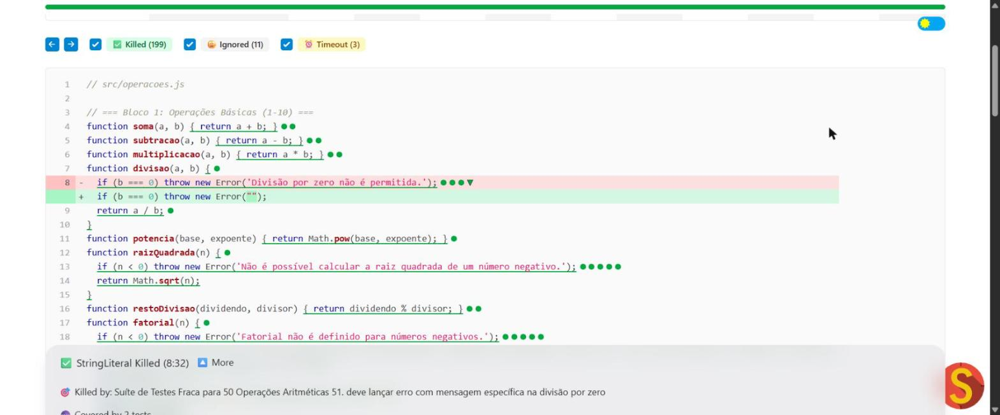
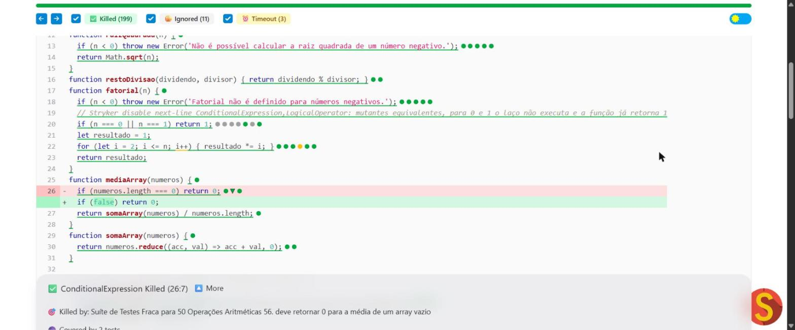
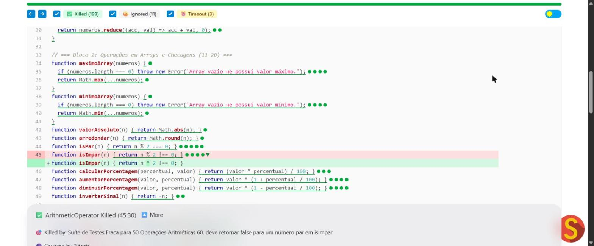
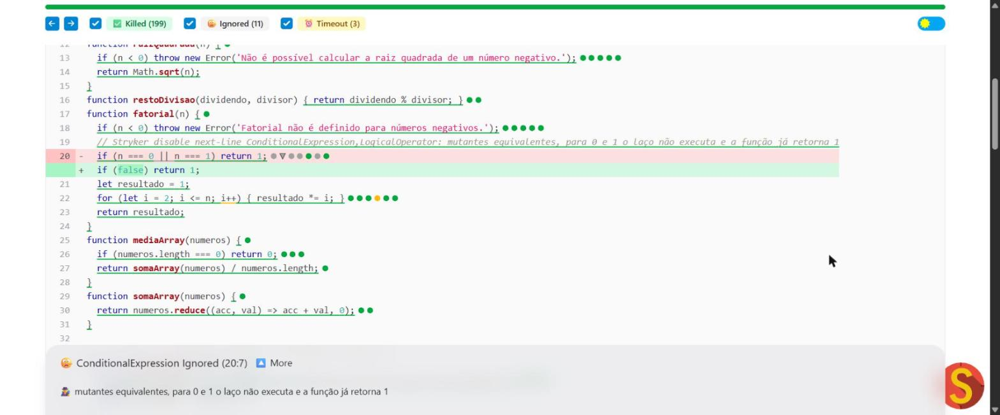
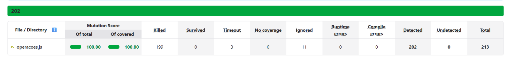

# Teste de Mutação com a "Calculadora Mutante"

**Disciplina:** Teste de Software  
**Aluno:** Arlindo Sérgio Pereira Junior  
**Matrícula:** 856882  
**Repositório:** https://github.com/ArlindoSPJr/operacoes-mutante

---

## 1. Análise inicial

A suíte original tinha 50 testes, um para cada função da biblioteca, e todos passavam.

| Métrica | Valor |
|---|---|
| Cobertura de código | 98,64% |
| Pontuação de mutação (sobre o total) | 73,71% |
| Pontuação de mutação (sobre o código coberto) | 78,11% |
| Mutantes gerados | 213 |
| Mortos | 154 |
| Timeout | 3 |
| Sobreviventes | 44 |
| Sem cobertura | 12 |

A cobertura estava quase em 100%, mas cerca de **1 em cada 4 mutantes não era detectado**. A suíte executava praticamente todo o código, porém com asserções fracas. Cada teste conferia um único "caminho feliz" e ignorava valores de limite, casos que deveriam retornar `false` e a mensagem das exceções.

---

## 2. Análise de três mutantes sobreviventes

Foram escolhidos três mutantes sobreviventes, cada um de um tipo de mutação diferente. Na versão original do código eles estavam nas linhas 8, 25 e 44. Os comentários de justificativa adicionados na seção 4 deslocaram as duas últimas em uma linha, por isso nas capturas do relatório final elas aparecem nas linhas 26 e 45.

### 2.1 Mutante de literal de texto (StringLiteral): linha 8, função `divisao`

**Código original:**
```js
if (b === 0) throw new Error('Divisão por zero não é permitida.');
```

**Código mutado:**
```js
if (b === 0) throw new Error("");
```

**Por que sobreviveu:** o teste original era:
```js
expect(() => divisao(5, 0)).toThrow();
```
Sem argumento, `toThrow()` só verifica que *alguma* exceção foi lançada. Não confere a mensagem. A versão mutada continua lançando uma exceção, só que com a mensagem vazia, então o teste passava.

**Teste que matou o mutante:**
```js
test('51. deve lançar erro com mensagem específica na divisão por zero', () => {
  expect(() => divisao(5, 0)).toThrow('Divisão por zero não é permitida.');
});
```
Agora o teste exige a mensagem exata. No mutante a mensagem é `""` e o teste falha.



*Figura 1: o mutante StringLiteral da linha 8 aparece como **Killed**, morto pelo teste 51.*

### 2.2 Mutante de expressão condicional (ConditionalExpression): linha 25, função `mediaArray`

**Código original:**
```js
if (numeros.length === 0) return 0;
```

**Código mutado:**
```js
if (false) return 0;
```

**Por que sobreviveu:** o único teste da função era:
```js
expect(mediaArray([10, 20, 30])).toBe(20);
```
Ele usa um array com elementos, então a condição `numeros.length === 0` é sempre falsa e o `return 0` nunca executa. Trocar a condição por `false` não muda nada nesse cenário. O caso do array vazio, que é justamente o que essa linha trata, não estava testado.

**Teste que matou o mutante:**
```js
test('56. deve retornar 0 para a média de um array vazio', () => {
  expect(mediaArray([])).toBe(0);
});
```
No mutante, o `if` nunca entra e a função calcula `0 / 0`, que dá `NaN` em vez de `0`. O teste falha.



*Figura 2: o mutante ConditionalExpression (linha 25 original, 26 no relatório final) aparece como **Killed**, morto pelo teste 56.*

### 2.3 Mutante de operador aritmético (ArithmeticOperator): linha 44, função `isImpar`

**Código original:**
```js
function isImpar(n) { return n % 2 !== 0; }
```

**Código mutado:**
```js
function isImpar(n) { return n * 2 !== 0; }
```

**Por que sobreviveu:** o teste original só verificava um número ímpar:
```js
expect(isImpar(7)).toBe(true);
```
Com `n = 7`, as duas versões retornam `true`: `7 % 2 = 1` e `7 * 2 = 14`, ambos diferentes de 0. O teste não diferenciava `%` de `*`. Nenhum teste verificava um número par, que é o caso em que a função deve retornar `false`.

**Teste que matou o mutante:**
```js
test('60. deve retornar false para um número par em isImpar', () => {
  expect(isImpar(4)).toBe(false);
});
```
No original, `4 % 2 = 0` e a função retorna `false`. No mutante, `4 * 2 = 8`, que é diferente de 0, e a função retorna `true`. O teste falha.



*Figura 3: o mutante ArithmeticOperator (linha 44 original, 45 no relatório final) aparece como **Killed**, morto pelo teste 60.*

---

## 3. Aprimoramento da suíte de testes

Foram adicionados **24 testes**, e a suíte passou de 50 para 74 testes. Além dos três casos acima, os demais mutantes sobreviventes foram mortos com estas estratégias:

- **Testar o caso `false` das funções booleanas:** `isPar`, `isImpar`, `isPrimo`, `isDivisivel`, `isMaiorQue`, `isMenorQue` e `isEqual` só eram testadas com entradas que retornavam `true`. Mutantes que trocavam a expressão por `true` passavam sem ser notados.
- **Usar valores de limite:** 0, 1, números negativos e valores iguais, como `raizQuadrada(0)`, `fatorial(0)`, `isPrimo(1)` e `isMaiorQue(5, 5)`. Esses valores matam mutantes que trocam `<` por `<=` ou `>` por `>=`.
- **Usar arrays vazios, desordenados e de tamanho par:** a função `medianaArray` só era testada com um array ímpar e já ordenado. Por isso remover a ordenação ou alterar o cálculo do caso par não fazia diferença.
- **Verificar a mensagem exata das exceções:** passar a mensagem para `toThrow`, como na seção 2.1.
- **Escolher entradas que diferenciem os operadores:** as conversões de temperatura eram testadas com 0 °C e 32 °F, valores em que `*` e `/` dão o mesmo resultado (zero). Com 100 °C e 212 °F a diferença aparece.

---

## 4. Validação final

A validação foi feita em duas etapas.

**Etapa 1: apenas novos testes.** Depois de adicionar os 24 testes, o Stryker foi executado de novo e a pontuação subiu para **96,71%**: 206 mutantes detectados e 7 sobreviventes. Esse valor ainda ficava abaixo da meta de 98%. Os 7 sobreviventes são **mutantes equivalentes**, que nenhum teste consegue matar.

**Etapa 2: tratamento dos mutantes equivalentes.** Um mutante equivalente é uma alteração que não muda o comportamento da função para nenhuma entrada. Os 7 encontrados foram analisados um a um:

- **`fatorial` (4 mutantes):** alteram ou anulam a condição `n === 0 || n === 1`. Sem ela, o laço `for (let i = 2; i <= n; i++)` não executa para 0 e 1, e a função já retorna `1`, o valor inicial de `resultado`.
- **`produtoArray` (1 mutante):** troca `if (numeros.length === 0)` por `if (false)`. Com array vazio, `reduce` com valor inicial `1` já retorna `1`.
- **`clamp` (2 mutantes):** trocam `valor < min` por `valor <= min` e `valor > max` por `valor >= max`. A diferença só aparece quando `valor` é igual ao limite, e aí retornar o limite ou o próprio `valor` dá o mesmo número.

Esses mutantes foram marcados com o recurso oficial do Stryker para esse caso: um comentário `// Stryker disable next-line` antes da linha. O comentário indica o tipo de mutação desativado e a justificativa. A lógica do código não foi alterada. Exemplo:

```js
// Stryker disable next-line ConditionalExpression,LogicalOperator: mutantes equivalentes, para 0 e 1 o laço não executa e a função já retorna 1
if (n === 0 || n === 1) return 1;
```

Com isso, esses mutantes aparecem no relatório como **Ignored** e saem do cálculo da pontuação. A desativação vale para o tipo de mutação na linha inteira, então foram ignorados 11 mutantes: os 7 equivalentes e mais 4 do mesmo tipo nessas linhas que já eram mortos pelos testes.



*Figura 4: mutante equivalente da função `fatorial` exibido como **Ignored**, com a justificativa registrada no comentário.*

### Resultado final

| Métrica | Inicial | Só novos testes | Final |
|---|---|---|---|
| Cobertura de código | 98,64% | 100% | **100%** |
| Pontuação de mutação (sobre o total) | 73,71% | 96,71% | **100%** |
| Pontuação de mutação (sobre o código coberto) | 78,11% | 96,71% | **100%** |
| Mortos | 154 | 203 | **199** |
| Timeout | 3 | 3 | **3** |
| Sobreviventes | 44 | 7 | **0** |
| Sem cobertura | 12 | 0 | **0** |
| Ignorados | 0 | 0 | **11** |
| Testes | 50 | 74 | **74** |



*Figura 5: resumo final do Stryker, com pontuação de mutação de 100%.*

A meta de pontuação de mutação superior a 98% foi atingida.

---

## 5. Conclusão

O trabalho mostrou na prática a diferença entre cobertura de código e qualidade dos testes. A suíte original tinha 98,64% de cobertura, mas deixava passar mais de um quarto dos mutantes, porque executava o código sem verificar o comportamento dele com rigor.

As principais lições foram:

1. **Asserções precisam ser específicas.** Verificar que "uma exceção foi lançada" não basta; é preciso verificar *qual* exceção.
2. **Testes precisam cobrir valores de limite e o caso negativo**, e não só o caminho feliz. A maioria dos mutantes sobreviventes estava em condições, comparações e retornos booleanos.
3. **As entradas precisam diferenciar os comportamentos possíveis.** Valores como 0 ou um número ímpar qualquer podem dar o mesmo resultado no código correto e no errado.
4. **Alguns mutantes são equivalentes** e não podem ser mortos por nenhum teste. Eles devem ser analisados, justificados e marcados explicitamente, e muitas vezes apontam código redundante.

Com 24 testes novos, a pontuação de mutação foi de 73,71% para 96,71%. Depois do tratamento justificado dos 7 mutantes equivalentes, chegou a **100%**.
